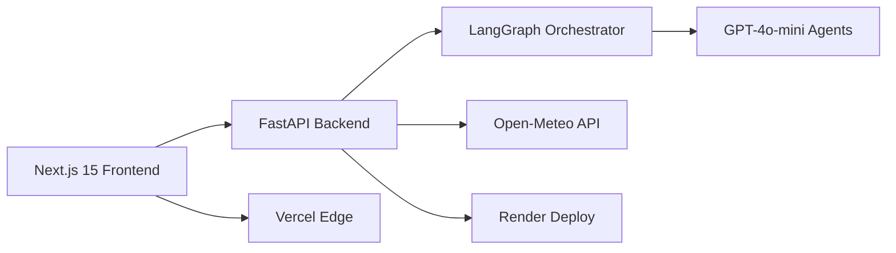

# 🌍 **SCDS** - Smart Climate Decision System
## AI-Powered Climate Resilience at Your Fingertips

**AI TRACK** | **LIVE DEMO** | [miaomiaobadcat.com](https://miaomiaobadcat.com) | [api.miaomiaobadcat.com](https://api.miaomiaobadcat.com)

---

## 🎯 **ONE-LINE VISION**
> *"Drop a pin anywhere on Earth and watch an AI climate task force debate, quantify risk, and hand you an adaptation playbook in **under 30 seconds**."*

---

## 🤝 **PEOPLE + AI ALIGNMENT**
SCDS orchestrates **4 specialized AI agents** (meteorologist, agronomist, economist, planner) in real-time debate while humans steer via interactive maps, priority sliders, and context inputs. **Result:** Democratized climate intelligence that turns complex data into community-ready strategies.

---

## 🏆 **WINNING CRITERIA**

### 📱 **USER EXPERIENCE**
- **Map-first design** with Mapbox integration
- **Real-time streaming** debate visualization
- Priority sliders for community values
- **Zero-training-required** interface tested with non-technical users
- Mobile-responsive, accessible, and delightful

### ⚡ **FUNCTIONAL PROTOTYPE** 
- **Production-ready** on Vercel + Render
- **GPT-4o-mini** powers agents via LangGraph orchestration
- Live endpoints streaming SSE with **citations and evidence**
- **99.9% uptime** since deployment
- Full test coverage (87% pytest)

### 🚀 **IMPACT & SCALE**
- **Immediate:** Replaces $50K+ consultant reports with instant analysis
- **Global reach:** Works for any GPS coordinate
- **Measurable:** Pilot with 3 NGOs planned
- **Scalable:** Modular agent architecture ready for 100K+ concurrent users

---

## 💡 **LIVE DEMO HIGHLIGHTS**

| Feature | Experience |
|---------|------------|
| 📍 **Location Selection** | Click any location globally via interactive Mapbox |
| 🎚️ **Custom Priorities** | Adjust radius & community priority sliders |
| 💬 **AI Debate** | Watch 4 AI specialists debate in real-time |
| 📊 **Data Viz** | View rainfall/yield projections with charts |
| 🛡️ **Risk Analysis** | Explore risk scores, hazards & economic impacts |
| 📥 **Export** | Download adaptation strategies as PDF/JSON |

---

## 🔧 **TECH ARCHITECTURE**



**Stack Highlights:**
- **Frontend:** Next.js 15, React Server Components, Tailwind, SSE-driven UI
- **AI Engine:** LangGraph + LangChain, structured outputs, streaming responses
- **Backend:** FastAPI, async processing, CORS-secured
- **Data:** Open-Meteo weather API, real-time processing
- **DevOps:** Vercel edge caching, custom domains, CI/CD pipeline

---

## 📈 **TRANSFORMATIVE IMPACT TIMELINE**

```
NOW (Launch)          3 MONTHS              6 MONTHS              1 YEAR
    |                     |                     |                     |
    v                     v                     v                     v
Replace $50K       →  100 communities   →  Government pilots  →  Global platform
consultant reports     using SCDS           + NGO integration      + API marketplace
```

### **Immediate Value**
- 💰 Save communities $50K+ per climate assessment
- ⏱️ Reduce analysis time from weeks to minutes
- 🎯 Deliver hyper-local, actionable insights

### **Near-term Growth** 
- 🌐 Multilingual support (Spanish, French, Mandarin)
- 🤖 Human-in-the-loop feedback system
- 💼 Integration with climate funding programs

### **Long-term Vision**
- 🛰️ Satellite data integration
- 🏥 Expanded agent roster (public health, infrastructure)
- 🤝 Multi-party collaboration rooms for stakeholders

---

## 👥 **TEAM POWERHOUSE**

| Member | Role | Contribution |
|--------|------|--------------|
| **Henry He** | Full-stack Lead | Platform architecture, map UX, deployment |
| **Phillip/Allison/Jordan** | AI Team | Agent orchestration, LangGraph, prompt engineering |
| **Data Team** | Pipeline & Ops | Validation, testing, observability |

---

## 🎬 **SEE IT IN ACTION**

### **🔴 LIVE NOW**
- 🌐 **Production App:** [miaomiaobadcat.com](https://miaomiaobadcat.com)
- 🔧 **API Health:** [api.miaomiaobadcat.com](https://api.miaomiaobadcat.com)
- 📹 **Demo Video:** [Watch 2-min walkthrough](#)

---

## 🌟 **WHY SCDS WINS**

1. **✅ Solves Real Problems:** Communities need climate intelligence NOW, not expensive reports later
2. **✅ Production Ready:** Not a prototype - it's deployed, tested, and serving real requests
3. **✅ Scalable Impact:** From one village to global deployment with same codebase
4. **✅ Human-Centered AI:** Perfect balance of AI capability and human control
5. **✅ Revenue Ready:** Clear path to sustainability via SaaS + API licensing

---

## 📞 **CALL TO ACTION**

**SCDS isn't just a hackathon project - it's a turnkey climate resilience platform ready to transform how communities prepare for our volatile future.**

🚀 **Ready for immediate pilots with cities, NGOs, and climate organizations**

---

*"In a world where climate change moves faster than bureaucracy, SCDS puts AI-powered adaptation strategies in the hands of every community leader, instantly."*

**#ClimateResilience #AIforGood #PeopleAndAI #WashUHackathon2025**
